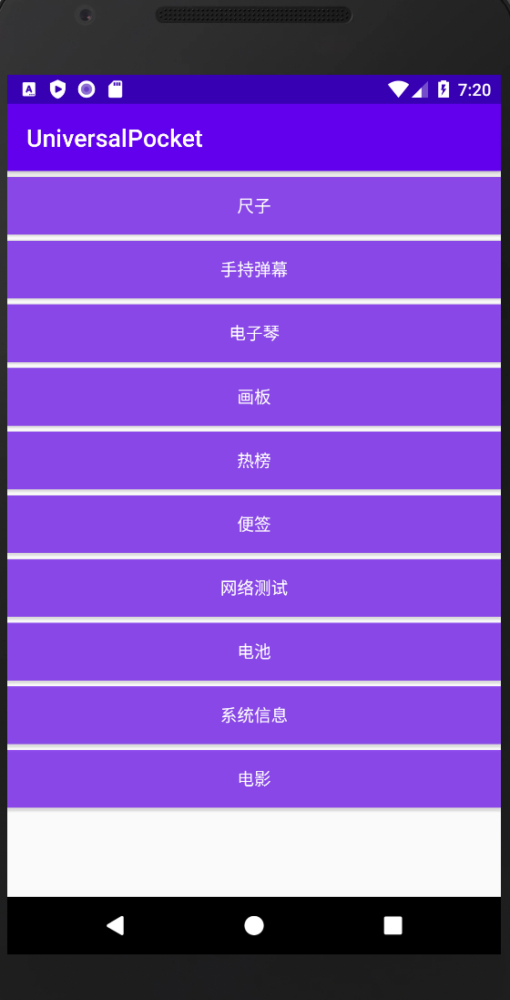
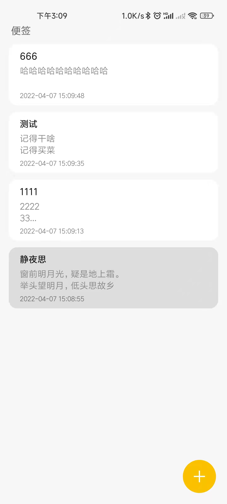

## UniversalPocket 

### Android开发的工具百宝箱。包含直尺、画板、全屏字幕、记事本、电子琴、各类热榜、电影......

## 下载体验
点击链接下载[https://github.com/MrHGJ/UniversalPocket/raw/master/apk/app-debug.apk]

或扫码下载apk进行体验： 
   

   

## 首页展示

   

   

## 功能展示
- **直尺：**
   

   

- **全屏字幕：**
   

   
   

   

  - **画板：**
   

   
   

   
    

   
  
  - **电子琴：**
   

   
  

  - **笔记：**
   

   
   

   
  
- **榜单聚合：**
   

   
  
榜单聚合某些api失效，暂时无法看全部功能